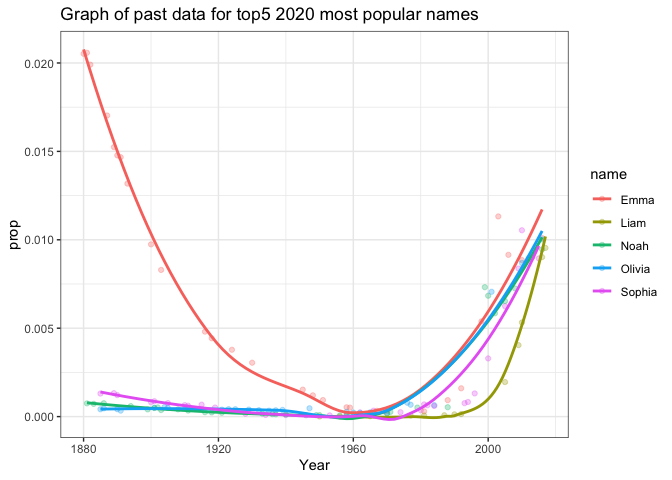

Documentation for Give Me A Name!
================
Nazanin Nezami
2/27/2020

bNames() function
=================

The main purpose of this function is to generate a list of baby names for any year between 1880 and 2017.

Usage
-----

-   **bNames(year,n,pf)**

Arguments
---------

### Required arguments

-   **year** : a numeric value(integer) which corresponds to a specific year. This value could range between 1880 and 2017.

-   **n**: a numeric value(integer) which corresponds to the number of names that the function will return.

### Optional arguments and their default values

-   **pf**: a numeric value (double) which corresponds to the proportion of female babies. The proportion could range from 0 to 1. It's default value is 0.5.

Output
------

The output of the function bNames() is a vector of *n* names representing a "typical" set of newborn babies in the given year. To accomplish this, the function randomly sample names from a given year in proportion to their popularity. The *p**f* argument determines what proportion of the names produced should be female; In other words, bNames() produces *p**f* \* *n* female names and (1 − *p**f*)\**n* male names by each call.

Other used packages and tools
-----------------------------

-   **library(babynames)**: This package consists of a single data frame, 'babynames', which contains all the names that occur at least 5 times in each year of the SSA database. The full dataset contains nearly 2 million rows (but loads virtually instantly into R).

-   **library(dplyr)**: Most of the data cleaning and manuplation parts have done by dyplyr functions(filter,group\_by,summarize,arrange,etc.) and %&gt;%(pipe). In this case to get the most popular names for the entered year and divide them into two sets based on gender.

-   **sample() function**: The specified names(by year and gender) are being sampled in proportion to their popularity (reflected by column *p**r**o**p* in the babynames data frame). The sampling is done with replacement (replace = TRUE).

Examples
--------

``` r
#### Test 1
bNames(1900,100,0.7)
```

    ## [1] "Female names are: "
    ##  [1] "Thelma"    "Jannie"    "Bessie"    "Anna"      "Evelyn"    "Ethel"    
    ##  [7] "Mary"      "Gertrude"  "Loretta"   "Edith"     "Emma"      "Bernice"  
    ## [13] "Elizabeth" "Anna"      "Ethel"     "Ethel"     "Maybelle"  "Alberta"  
    ## [19] "Cherrie"   "Gertrude"  "Lois"      "Diane"     "Ada"       "Lillie"   
    ## [25] "Flora"     "Josefa"    "Marion"    "Eliza"     "Lillian"   "Amelia"   
    ## [31] "Marjorie"  "Marie"     "Jannie"    "Stella"    "Tressa"    "Viola"    
    ## [37] "Pearl"     "Mabel"     "Bessie"    "Gertrude"  "Louise"    "Rosie"    
    ## [43] "Anita"     "Dorothy"   "Mamie"     "Elsie"     "Agnes"     "Fannie"   
    ## [49] "Alice"     "Beatrice"  "Elizabeth" "Catherine" "Helen"     "Lula"     
    ## [55] "Olivia"    "Elsie"     "Mae"       "Rosalie"   "Loretto"   "Carrie"   
    ## [61] "Nell"      "Margaret"  "Mabel"     "Coral"     "Lottie"    "Joe"      
    ## [67] "Edith"     "Rose"      "Marie"     "Joanna"   
    ## [1] "Male names are: "
    ##  [1] "Richard"  "Fred"     "Edward"   "William"  "Stanley"  "John"    
    ##  [7] "George"   "Joe"      "Bruno"    "Golden"   "Edwin"    "Pedro"   
    ## [13] "Frank"    "Eugene"   "Arthur"   "Robert"   "Paul"     "Lyman"   
    ## [19] "Claudie"  "General"  "Robert"   "Leonard"  "Bud"      "Louie"   
    ## [25] "Harry"    "Tom"      "Chester"  "Louis"    "Lee"      "Laurence"

``` r
#### Test 2
bNames(1800,100,0.3)
```

    ## [1] " The year you entered is prior to 1880 or after 2017! There is no data available beyond this range!"

``` r
#### Test 3
bNames(2000,20)
```

    ## [1] "Female names are: "
    ##  [1] "Kyrah"    "Genesis"  "Ava"      "Kacee"    "Hayley"   "Jasmine" 
    ##  [7] "Elaina"   "Samantha" "Saadia"   "Kyra"    
    ## [1] "Male names are: "
    ##  [1] "Blake"     "Joshua"    "Giovanni"  "Sebastian" "Benjamin"  "Devin"    
    ##  [7] "Scott"     "Ian"       "Angelo"    "Byron"

bNamesPred() function
=====================

The main purpose of this function is to generate a list of baby names for any year between 1880 through 2025. Basically, it enables us to generate names for the near future (untill 2025) based on the observed trend in names' popularity.

Arguments
---------

### Required arguments

-   **year** : a numeric value(integer) which corresponds to a specific year. This value could range between 1880 and 2025.

-   **n**: a numeric value(integer) which corresponds to the number of names that the function will return. (Note: due to computation time, this number should be less than 1000 for years 2018-2025 )

### Optional arguments and their default values

-   **pf**: a numeric value (double) which corresponds to the proportion of female babies. The proportion could range from 0 to 1. It's default value is 0.5.

Out put
-------

The output of the function bNamesPred() is a vector of *n* names representing a "typical" set of newborn babies in the given year. To accomplish this, the function randomly sample names from a given year in proportion to their popularity or try to predict future names based on a predicted popularity (for years after 2017). The *p**f* argument determines what proportion of the names produced should be female; In other words, bNamesPred() produces *p**f* \* *n* female names and (1 − *p**f*)\**n* male names by each call.

Other used packages and tools
-----------------------------

-   **library(babynames)**: This package consists of a single data frame, 'babynames', which contains all the names that occur at least 5 times in each year of the SSA database. The full dataset contains nearly 2 million rows (but loads virtually instantly into R).

-   **library(dplyr)**: Most of the data cleaning and manuplation parts have done by dyplyr functions(filter,group\_by,summarize,arrange,etc.) and %&gt;%(pipe). In this case to get the most popular names for the entered year and divide them into two sets based on gender.

-   **sample() function**: The specified names(by year and gender) are being sampled in proportion to their popularity (reflected by column *p**r**o**p* for years before 2018 and with *p**r**e**d* − *p**r**o**p* for years 2018-2025). The sampling is done with replacement (replace = TRUE).

-   **lm() function**: Modeling the specified data with Linear regression. In this case *P**r**o**p* would be the response variable and we want to use *y**e**a**r* in order to find the fit a model to it.

-   **predict() function**: Making prediction for the *P**r**o**p* value of each name based on the fitted model and the year (2018-2025) which have been defined before.

Examples
--------

``` r
#### Test 1
bNamesPred(1800,100,0.3)
```

    ## [1] " There is no data or prediction available for the year you entered !"

``` r
#### Test 2
bNamesPred(2026,100,0.3)
```

    ## [1] " There is no data or prediction available for the year you entered !"

``` r
#### Test 3
bNamesPred(2000,100,0.3)
```

    ## [1] "Female names are: "
    ##  [1] "Zena"      "Rhiannon"  "Brittany"  "Gina"      "Jessica"   "Rachel"   
    ##  [7] "Briann"    "Angela"    "Clayton"   "Ryan"      "Leila"     "Shakayla" 
    ## [13] "Carolina"  "Kiersten"  "Faith"     "Alejandra" "Mackenzie" "Hailey"   
    ## [19] "Sierra"    "Briley"    "Nicole"    "Sophia"    "Marissa"   "Tori"     
    ## [25] "Jasmine"   "Vanessa"   "Lucy"      "Lauren"    "Holly"     "Savannah" 
    ## [1] "Male names are: "
    ##  [1] "Joseph"      "Germaine"    "Zachary"     "Joshua"      "Preston"    
    ##  [6] "Shmuel"      "Charles"     "Jace"        "Carlos"      "Joshua"     
    ## [11] "Samuel"      "Finn"        "Derrick"     "Martin"      "Antonio"    
    ## [16] "Elijah"      "Nicholas"    "Bryce"       "Zackary"     "Dalton"     
    ## [21] "Jacky"       "Josef"       "Thayne"      "Sean"        "Darrell"    
    ## [26] "Joshua"      "Devin"       "Emmanuel"    "Ryan"        "Terrence"   
    ## [31] "Caden"       "Christopher" "William"     "Sean"        "Dennys"     
    ## [36] "Otto"        "Adriel"      "Reed"        "Sean"        "Landon"     
    ## [41] "Joshua"      "Ezekiel"     "Frank"       "Jacob"       "David"      
    ## [46] "Tyler"       "Isaac"       "Brandon"     "Christian"   "Darius"     
    ## [51] "Devon"       "Jonah"       "William"     "Andres"      "Dedric"     
    ## [56] "Lamar"       "Adrian"      "Jaden"       "Michael"     "Chase"      
    ## [61] "William"     "Shyam"       "Hector"      "Jared"       "Carlos"     
    ## [66] "Javier"      "Juan"        "Tanner"      "Daevin"      "William"

``` r
#### Test 4
bNamesPred(2022,100,0.3)
```

    ## [1] " The results are based on prediction "
    ## [1] "Female names are: "
    ##  [1] "Sophia"    "Emily"     "Bianca"    "Nova"      "Reagan"    "Brooklyn" 
    ##  [7] "Harper"    "Aaliyah"   "Adalyn"    "Zara"      "Zara"      "Amina"    
    ## [13] "Hazel"     "Charlotte" "Ruby"      "Amelia"    "Charlotte" "Catherine"
    ## [19] "Annabelle" "Natalie"   "Zariah"    "Emma"      "Thea"      "Aubree"   
    ## [25] "Everly"    "Olivia"    "Janiya"    "Alayna"    "Lillian"   "Riley"    
    ## [1] "Male names are: "
    ##  [1] "Adrian"    "King"      "Quinn"     "Daniel"    "Nolan"     "Reed"     
    ##  [7] "Alan"      "Kolton"    "Elijah"    "Elias"     "Kai"       "Morgan"   
    ## [13] "Leo"       "Joseph"    "Zane"      "Elias"     "Gunnar"    "Liam"     
    ## [19] "Asher"     "Elias"     "Chase"     "Adriel"    "Jensen"    "Lincoln"  
    ## [25] "Henry"     "Axel"      "Josiah"    "Sebastian" "Greyson"   "Liam"     
    ## [31] "Judah"     "Brantley"  "Gavin"     "Luke"      "Quinn"     "Mateo"    
    ## [37] "Caiden"    "Easton"    "Aiden"     "Jasper"    "Jay"       "Ryder"    
    ## [43] "Liam"      "Josiah"    "Luke"      "Julius"    "Liam"      "Angel"    
    ## [49] "Ayden"     "Silas"     "Aiden"     "Colton"    "Max"       "Luke"     
    ## [55] "Joaquin"   "Silas"     "Eli"       "August"    "Noah"      "Marcus"   
    ## [61] "Everett"   "Jayden"    "Noah"      "Camden"    "Evan"      "Easton"   
    ## [67] "Graham"    "Alexander" "Josiah"    "Nolan"

How bNamesPred() function predicts baby names?
----------------------------------------------

``` r
options(warn=-1)

## reducing my dataset to get easier 
        new<- babynames %>%
        filter(year>=2000 & year<=2017) %>%
         top_n(15000,prop)
         # Based on trial, we need at least 15000 obs in order to get 1000              #positive prediction values (prop) for future
        
        Year1<- data.frame(year =2022) #creating a dataframe to use in                                                  #predict function
        prediction <- new%>%
        group_by(name,sex)%>%
        summarize(pred_prop=predict(lm(prop ~ year),Year1) ) %>%
        filter(pred_prop>=0)%>%
        arrange(desc(pred_prop)) #pred_prop is my predicted prop for each of                                           #top popular names
      
        head(prediction)
```

    ## # A tibble: 6 x 3
    ## # Groups:   name [6]
    ##   name     sex   pred_prop
    ##   <chr>    <chr>     <dbl>
    ## 1 Sophia   F        0.0129
    ## 2 Liam     M        0.0128
    ## 3 Ava      F        0.0122
    ## 4 Emma     F        0.0117
    ## 5 Isabella F        0.0113
    ## 6 Olivia   F        0.0112

As mentioned in the comment part of the above section, bNamesPred() function use a linear regression model to predict the future names. In this regard, we will run the regression model for the most popular 15000 names which belong to recent 17 years(2000-2017). As a result, we usually get about 1000 positive predicted values for the names popularity denoted by *p**r**e**d* − *p**r**o**p* for each given year(2018-2025). Then, we can use these predicted values of the prop instead of weights to do the sampling part. Finally, we can print a list of names for future (based on n and pf values).

Popularity of Sophia and Jackson in 2020
----------------------------------------

``` r
# reducing dataset by considering top 15000 names from recent 7 years
## This section has done above:  
       # new<- babynames %>%
       # filter(year>=2000 & year<=2017) %>%
        # top_n(15000,prop)

        Year2<- data.frame(year =2020) #creating a dataframe to use in predict                                           function for year=2020
        prediction2 <- new%>%
        group_by(name,sex)%>%
        filter(name=="Sophia" || name=="Jackson")%>% 
        summarize(pred_prop=predict(lm(prop ~ year),Year2) ) %>%
        filter(pred_prop>=0)%>%
        arrange(desc(pred_prop)) #pred_prop is my predicted prop for each of                                           top popular names 
      
# Now, lets see the prediction for these two names
        prediction2 
```

    ## # A tibble: 2 x 3
    ## # Groups:   name [2]
    ##   name    sex   pred_prop
    ##   <chr>   <chr>     <dbl>
    ## 1 Sophia  F       0.0122 
    ## 2 Jackson M       0.00697

Based on the above model, we can get the predicted prop for these two names which can indicate:

-   Both predicted prop are positive which means that the popularity of these 2 names will increase in the future, e.g 2020. Therefore, we still may want to predict them as probable common names in future.

-   The predicted prop for Sophia is 0.012 , while the predicted prop for Jackson is 0.0069. Comparing the popularity values indicates that Sophia will be more common than Jackson in the 2020.

-   The model will use the predicted prop values as weights to sample the future names, so we can expect to get Sophia to appear more Jachson in list of names for 2020 (although sampling at random) .

Table of the most 10 popular names in 2020
------------------------------------------

| name      | sex |  pred\_prop|
|:----------|:----|-----------:|
| Liam      | M   |   0.0116056|
| Sophia    | F   |   0.0114288|
| Emma      | F   |   0.0113416|
| Olivia    | F   |   0.0108248|
| Noah      | M   |   0.0104467|
| Mason     | M   |   0.0098567|
| Isabella  | F   |   0.0097505|
| Oliver    | M   |   0.0090121|
| Charlotte | F   |   0.0087507|
| Ava       | F   |   0.0086232|

Plot of the trend in the top 5 names popularity from 1880 until 2017
--------------------------------------------------------------------



References
==========

-<a href="https://cran.r-project.org/web/packages/babynames/babynames.pdf"> Babyname Package</a>

-<a href="https://bookdown.org/yihui/rmarkdown"> Rmarkdown Book</a>

-<a href="https://www.w3schools.com/html/html_links.asp"> HTML Guide</a>

-<a href="https://rstudio.com/wp-content/uploads/2016/03/rmarkdown-cheatsheet-2.0.pdf">Rmarkdown Cheet sheet</a>
